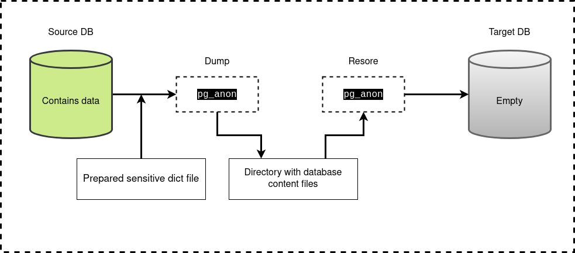
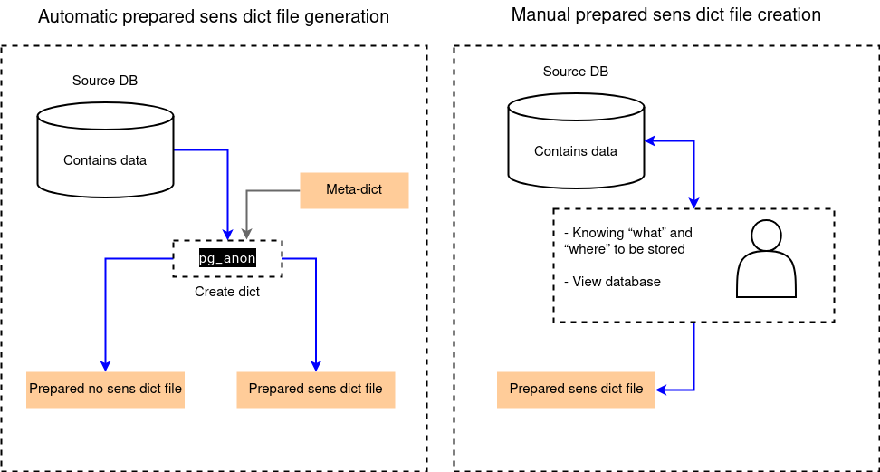
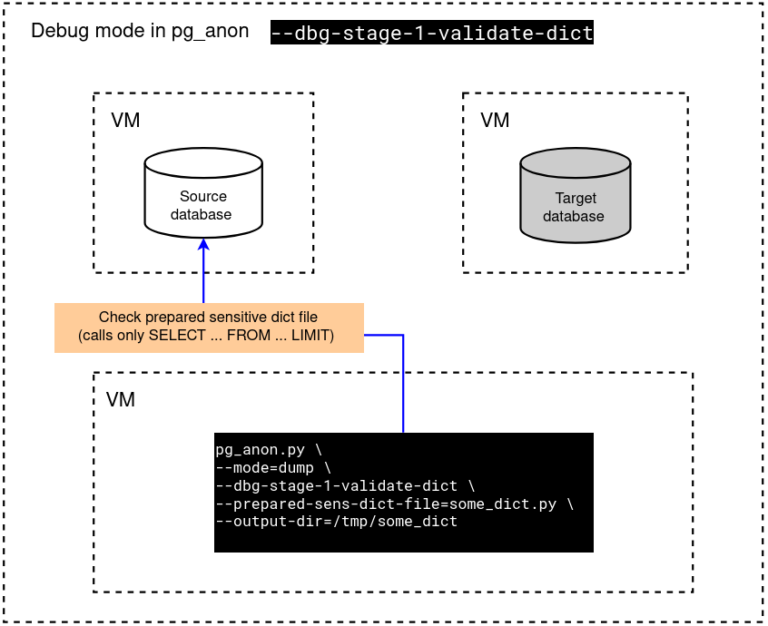
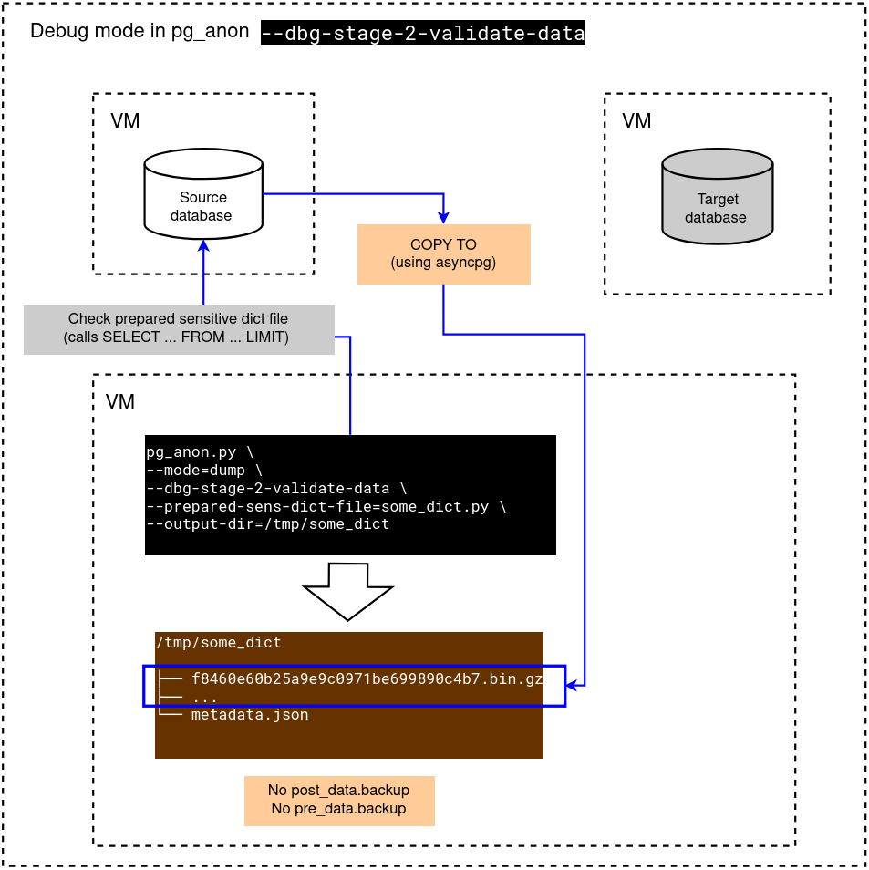
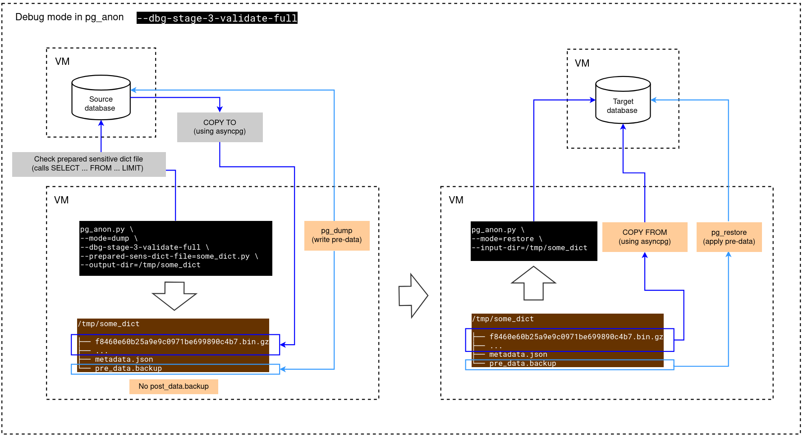

# pg_anon

## Overview

`pg_anon` is an efficient tool for the anonymization of Postgres data specifically designed for IT companies. These companies often store "sensitive" data that includes both commercial secrets and personal user information such as contact numbers, passport details, etc.

The tool comes in handy when it is necessary to transfer the database contents from the production environment to other environments for performance testing or functionality debugging during the development process. With `pg_anon`, no sensitive data is exposed, preventing potential data leaks.

## Terminology


| Term                            | Description                                                                                                                                                                                                                                                                                                                                                 |
|---------------------------------|-------------------------------------------------------------------------------------------------------------------------------------------------------------------------------------------------------------------------------------------------------------------------------------------------------------------------------------------------------------|
| Source database (source DB)     | A database containing fields that need to be anonymized.                                                                                                                                                                                                                                                                                                    |
| Target database (target DB)     | An empty database for `--mode=restore`. It can also contain a structure for the `--mode=sync-data-restore`.                                                                                                                                                                                                                                                 |
| Personal (sensitive) data       | Data containing information that must not be transferred to other storage recipients or third parties and that constitutes a trade secret.                                                                                                                                                                                                                  |
| Prepared sensitive dict file    | A file with a *.py extension containing an object that describes tables, fields, and methods for replacing the values of these fields. The dictionary file can be manually written by a developer or generated automatically.                                                                                                                               |
| Prepared no sensitive dict file | A *.py file contains a list of objects structured as schema, table, and fields. This dictionary is used for re-scanning in create-dict mode and can be either manually created by a developer or generated automatically.                                                                                                                                   |
| Meta-dictionary                 | A file with a *.py extension containing an object that describes rules for identifying personal (sensitive) data. The meta-dictionary is created manually by the user. Based on the meta-dictionary, the prepared sensitive dict file is then created. The process of automatically creating a dictionary is called "exploration." or `--mode=create-dict`. |
| Create dict (or scanning)       | The process of scanning a source database and searching for sensitive fields based on a meta dictionary. As a result, a prepared sens dict file is created and, if necessary, a prepared no sens dict file.                                                                                                                                                 |
| Dump                            | The process of writing the contents of a source database into files using a specified dictionary. The dump can be partial or complete. In fact, this is the stage where masking takes place.                                                                                                                                                                |
| Restore                         | The process of loading data from files into the target database. The target database should not contain any objects.                                                                                                                                                                                                                                        |
| Anonymization (masking)         | The process of cloning a database, consisting of the steps dump -> restore, during which sensitive data will be replaced with random or hashed values.                                                                                                                                                                                                      |
| Anonymization function          | A built-in PostgreSQL function or a function from the anon_funcs schema that changes the input value to a random or hashed one. The anon_funcs schema contains a ready-made library of functions. New functions can be added to this schema to transform fields subject to anonymization for subsequent use in dictionaries.                                |


### Visual representation of terms

#### Anonymization (masking)

The diagram below shows the process of transferring data from the `source DB` to the `target DB`. The source database contains sensitive data, as a rule, this database is located in an industrial environment and a strictly fixed number of employees have access to the database.



`pg_anon` is launched by a trusted administrator with credentials for connecting to the `source database` and based on the specified dictionary, a dump is performed to the specified directory on the file system. The process in question uses a dictionary prepared in advance and agreed upon with the security team. Next, the resulting directory with files should be transferred to the host of the `target database`. There is no need to use compression when transferring a directory with a dump, because the data files are already compressed.
When the directory is placed on the host with the `target database`, the restore process should be started with the credentials of the `target database`. The `target database` must be prepared in advance by the CREATE DATABASE command and does not contain any objects. If there are user tables in the `target database`, the restore process will not start. When the restore is completed successfully, the database will be ready for development or testing tasks, during which an arbitrary number of employees will connect to the database without the risk of leakage of sensitive data. 

P.S. `--mode=sync-data-restore` can be run into the non-empty `target DB` with prepared structure.

#### The process of creating a dictionary

There are two processes for creating a dictionary:
- Manual dictionary creation
- Automatic dictionary creation


The diagram below shows both dictionary creation processes.



## Features

`pg_anon` works in several modes:

- **`init`**: Creates `anon_funcs` schema with anonymization functions.
- **`create-dict`**: Scans the DB data and creates a prepared sens dict file with an anonymization profile and a prepared no sens dict file for faster work in other time in mode `create-dict`.
- **`view-fields`**: Renders table with fields which will be anonymized and which rules will be used for this. The table contains `schema`, `table`, `field`, `type`, `dict_file_name`, `rule` fields which are based on a prepared sensitive dictionary. 
- **`view-data`**: Show adjusted table with applied anonymization rules from prepared sensitive dictionary file.
- **`dump`**: Creates a database structure dump using Postgres `pg_dump` tool, and data dumps using `COPY ...` queries with anonymization functions. The data dump step saves data locally in `*.bin.gz` format. During this step, the data is anonymized on the database side by `anon_funcs`.
- **`restore`**: Restores database structure using Postgres `pg_restore` tool and data from the dump to the target DB. `restore` mode can separately restore database structure or data.
- **`sync-struct-dump`**: Creates a database structure dump using Postgres `pg_dump` tool
- **`sync-data-dump`**: Creates a database data dump using `COPY ...` queries with anonymization functions. The data dump step saves data locally in `*.bin.gz` format. During this step, the data is anonymized on the database side by `anon_funcs`.
- **`sync-struct-restore`**: Restores database structure using Postgres `pg_restore` tool
- **`sync-data-restore`**: Restores database data from the dump to the target DB.


## Requirements & Dependencies

`pg_anon` is based on `Python3` and also requires the third-party libraries listed in `requirements.txt`.

It uses the following tools and technologies:

- Postgres [`pg_dump`](https://www.postgresql.org/docs/current/app-pgdump.html) tool for dumping the database structure.
- Postgres [`pg_restore`](https://www.postgresql.org/docs/current/app-pgrestore.html) tool for restoring the database structure.
- Postgres [functions](https://www.postgresql.org/docs/current/functions.html) for the anonymization process.

## Installation Guide

### Preconditions

The tool supports Python3.11 and higher versions. The code is hosted on the following repository: [pg_anon repository on Github](https://github.com/TantorLabs/pg_anon).

### Installation Instructions

Installation processes slightly differ depending on your operating system.

#### macOS

1. Install Python3 if it isn't installed:
   - Install [Homebrew](https://brew.sh/)
   - [`brew install python@3.11`](https://formulae.brew.sh/formula/python@3.11)
2. Clone the repository: `git clone https://github.com/TantorLabs/pg_anon.git`
3. Go to the project directory: `cd pg_anon`
4. Set up a virtual environment:
   - Install the virtual environment: `python3 -m venv venv`
   - Activate the virtual environment: `source venv/bin/activate`
5. Install the dependencies: `pip install -r requirements.txt`

#### Ubuntu/Redhat/CentOS

1. Install Python3 if it isn't installed: `sudo apt-get install python3.11` (for Ubuntu), `sudo yum install python311` (for Redhat/Centos)
2. Clone the repository: `git clone https://github.com/TantorLabs/pg_anon.git`
3. Go to the project directory: `cd pg_anon`
4. Set up a virtual environment:
   - Install the virtual environment: `python3 -m venv venv`
   - Activate the virtual environment: `source venv/bin/activate`
5. Install the dependencies: `pip install -r requirements.txt`

#### Windows 7/Windows 11

1. Install Python3 if it isn't installed: Download it from the official [Python website](https://www.python.org/downloads/)
2. Clone the repository: `git clone https://github.com/TantorLabs/pg_anon.git`
3. Go to the project directory: `cd pg_anon`
4. Set up a virtual environment:
   - Install the virtual environment: `py -m venv venv`
   - Activate the virtual environment: `.\venv\Scripts\activate`
5. Install the dependencies: `pip install -r requirements.txt`

## Testing

To test `pg_anon`, you need to have a local database installed. This section covers the installation of postgres and running the test suite.

### Setting Up PostgreSQL

To facilitate the testing, here are instructions on how to set up PostgreSQL on Ubuntu:

1. Add repository configuration:

   ```commandline
   echo "deb [arch=amd64] http://apt.postgresql.org/pub/repos/apt focal-pgdg main" >> /etc/apt/sources.list.d/pgdg.list
   wget --quiet -O - https://www.postgresql.org/media/keys/ACCC4CF8.asc | apt-key add -
   ```

2. Update packages and install PostgreSQL:

   ```commandline
   apt -y install postgresql-15 postgresql-client-15
   ```

3. Allow connections to the PostgreSQL server:
   ```commandline
   sed -i  '/listen_addresses/s/^#//g' /etc/postgresql/15/main/postgresql.conf
   sed -ie "s/^listen_addresses.*/listen_addresses = '127.0.0.1'/" /etc/postgresql/15/main/postgresql.conf
   sed -i -e '/local.*peer/s/postgres/all/' -e 's/peer\|md5/trust/g' /etc/postgresql/${PG_VERSION}/main/pg_hba.conf
   ```
4. Restart the PostgreSQL instance for the changes to take effect:
   ```commandline
   pg_ctlcluster 15 main restart
   ```
5. Create a test user with superuser rights to allow running the COPY commands:
   ```commandline
   psql -c "CREATE USER anon_test_user WITH PASSWORD 'mYy5RexGsZ' SUPERUSER;" -U postgres
   ```

### Executing Tests

To validate that your setup is functioning correctly, run the unit tests:

```commandline
export PYTHONPATH=$(pwd)
python tests/test_full.py -v
```

Upon successful execution, the output should resemble the following:

```commandline
Ran N tests in ...
OK
```

If all tests pass, the application is ready to use.

To run a specific test case, use the following pattern:

```commandline
export PYTHONPATH=$(pwd)
python tests/test_full.py -v PGAnonValidateUnitTest
```

### Test Database Configuration

Test database connection settings can be overridden using environment variables:

```commandline
set TEST_DB_USER=anon_test_user
set TEST_DB_USER_PASSWORD=mYy5RexGsZ
set TEST_DB_HOST=127.0.0.1
set TEST_DB_PORT=5432
set TEST_SOURCE_DB=test_source_db
set TEST_TARGET_DB=test_target_db
```

## Usage

To display the help message for the CLI, run:

```commandline
python pg_anon.py --help
```

Common pg_anon options:

| Option        | Description                                                    |
|---------------|----------------------------------------------------------------|
| `--debug`     | Enable debug mode (default false)                              |
| `--verbose`   | Configure verbose mode: [info, debug, error] (default info)    |
| `--threads`   | Amount of threads for IO operations (default 4)                |
| `--processes` | Amount of processes for multiprocessing operations (default 4) |

Database configuration options:

| Option                | Description                                                                                         |
|-----------------------|-----------------------------------------------------------------------------------------------------|
| `--db-host`           | Specifies your database host                                                                        |
| `--db-port`           | Specifies your database port                                                                        |
| `--db-name`           | Specifies your database name                                                                        |
| `--db-user`           | Specifies your database user                                                                        |
| `--db-user-password`  | Specifies your database user password                                                               |
| `--db-passfile`       | Path to the file containing the password to be used when connecting to the database                 |
| `--db-ssl-key-file`   | Path to the client SSL key file for secure connections to the database                              |
| `--db-ssl-cert-file`  | Path to the client SSL certificate file for secure connections to the database                      |
| `--db-ssl-ca-file`    | Path to the root SSL certificate file. This certificate is used to verify the server's certificate  |

### Run init mode

To init schema "anon_funcs", run pg_anon in 'init' mode:

```commandline
python pg_anon.py --mode=init \
                  --db-user=postgres \
                  --db-user-password=postgres \
                  --db-name=test_source_db
```

### Run create_dict mode

#### Prerequisites:

- Generated or manually created dictionary `*.py` file with anonymization profile
- "anon_funcs" created in init mode

To create the dictionary:

```commandline
python pg_anon.py --mode=create-dict \
                  --db-user=postgres \
                  --db-user-password=postgres \
                  --db-name=test_source_db \
                  --meta-dict-file=test_meta_dict.py \
                  --prepared-sens-dict-file=test_sens_dict_output_previous_use.py \
                  --prepared-no-sens-dict-file=test_no_sens_dict_output_previous_use.py \
                  --output-sens-dict-file=test_sens_dict_output.py \
                  --output-no-sens-dict-file=test_no_sens_dict_output.py \
                  --processes=2
```

| Option                         | Description                                                                                                                                                  |
|--------------------------------|--------------------------------------------------------------------------------------------------------------------------------------------------------------|
| `--meta-dict-file`             | Input file or file list with scan rules of sensitive and not sensitive fields. In collision case, priority has first file in list                            |
| `--prepared-sens-dict-file`    | Input file or file list with sensitive fields, which was obtained in previous use by option `--output-sens-dict-file` or prepared manually (Optional)        |
| `--prepared-no-sens-dict-file` | Input file or file list with not sensitive fields, which was obtained in previous use by option `--output-no-sens-dict-file` or prepared manually (Optional) |
| `--output-sens-dict-file`      | Output file with sensitive fields will be saved to this value                                                                                                |
| `--output-no-sens-dict-file`   | Output file with not sensitive fields will be saved to this value (Optional)                                                                                 |
| `--scan-mode`                  | defines whether to scan all data or only part of it ["full", "partial"] (default "partial")                                                                  |
| `--scan-partial-rows`          | In `--scan-mode partial` defines amount of rows to scan (default 10000)                                                                                      |

#### Requirements for input --meta-dict-file (metadict):

Input metadict.py file should contain that type of structure:
```python
var = {
    "field": {  # Which fields to anonymize without scanning the content
        "rules": [  # List of regular expressions to search for fields by name
            "^fld_5_em",
            "^amount"
        ],
        "constants": [  # List of constant field names
            "usd",
            "name"
        ]
    },
    "skip_rules": [  # List of schemas, tables, and fields to skip
        {
            # possibly some schema or table contains a lot of data that is not worth scanning. Skipped objects will not be automatically included in the resulting dictionary. Masks are not supported in this object.
            "schema": "schm_mask_ext_exclude_2",  # Schema specification is mandatory
            "table": "card_numbers",  # Optional. If there is no "table", the entire schema will be skipped.
            "fields": ["val_skip"]  # Optional. If there are no "fields", the entire table will be skipped.
        }
    ],
    "include_rules": [ # List of schemas, tables, and fields which will be scanning
        {
            # possibly you need specific fields for scanning or you can debug some functions on specific field
            "schema": "schm_other_2", # Required. Schema specification is mandatory
            "table": "tbl_test_anon_functions", # Optional. If there is no "table", the entire schema will be included.
            "fields": ["fld_5_email"] # Optional. If there are no "fields", the entire table will be included.             
        }
    ],
    "data_regex": {  # List of regular expressions to search for sensitive data
        "rules": [
            """[A-Za-z0-9]+([._-][A-Za-z0-9]+)*@[A-Za-z0-9-]+(\.[A-Za-z]{2,})+""",  # email
            "7?[\d]{10}"  # phone 7XXXXXXXXXX 
        ]
    },
    "data_const": {
        # List of constants in lowercase, upon detection of which the field will be included in the resulting dictionary. If a text field contains a value consisting of several words, this value will be split into words, converted to lowercase, and matched with the constants from this list. Words shorter than 5 characters are ignored. Search is performed using set.intersection
        "constants": [  # When reading the meta-dictionary, the values of this list are placed in a set container
            "simpson",
            "account"
        ],
        # List of partial constants. If field value has substring from this list, it will considered as sensitive
        "partial_constants": [ # When reading the meta-dictionary, the values of this list are placed in a set container
            "@example.com",
            "login_"
        ]
    },
    "data_func": { # List of functions for specific field types  
        "text": [ # Field type, which will be checked by functions bellow. Can use custom types. Also, can use common type "anyelement" for all field types. Rules for "anyelement" will be added for all types rules after their own rules.
            {
                "scan_func": "my_custom_functions.check_by_users_table", # Function for scanning field value. Scan function has fixed call signature: (value, schema_name, table_name, field_name). Also , this function must return boolean result. 
                "anon_func": "anon_funcs.digest(\"%s\", 'salt_word', 'md5')", # Function will be called for anonymization in dump step
                "n_count": 100, # How many times "scan_func" have to returns "True" by values in one field. If this count will be reached, then this field will be anonymized by "anon_func" 
            },
        ],
    },
    "data_sql_condition": [ # List of rules for define data sampling for specific tables by custom conditions
        {
           "schema": "schm_mask_ext_exclude_2", # Can use "schema" for full name matching or "schema_mask" for regexp matching. Required one of them
           "table_mask": "*", # Can use "table" for full name matching or "table_mask" for regexp matching. Required one of them
           "sql_condition": # Condition in raw SQL format. For example, we need data sample created by 2024 year
           """
           WHERE created > '2024-01-01' AND created < '2024-12-31'
           """
        }
    ],
    "sens_pg_types": [
        # List of field types which should be checked (other types won't be checked). If this massive is empty program set default SENS_PG_TYPES = ["text", "integer", "bigint", "character", "json"]
        "text",
        "integer",
        "bigint",
        "varchar",  # better write small names, because checker find substrings in original name. For example types varchar(3) contains varchar, so varchar(3) will be checked in program.
        "json"
    ],
    "funcs": {  # List of field types (int, text, ...) and functions for anonymization
        # If a certain field is found during scanning, a function listed in this list will be used according to its type.
        "text": "anon_funcs.digest(\"%s\", 'salt_word', 'md5')",
        "numeric": "anon_funcs.noise(\"%s\", 10)",
        "timestamp": "anon_funcs.dnoise(\"%s\",  interval '6 month')"
    }
}
```

### Run dump mode

#### Prerequisites:

- `anon_funcs` schema with anonymization functions should be created. See [--mode init](#run-init-mode) example.
- output dict file with meta information about database fields, and it's anonymization should be created.
  See [--mode create-dict](#run-create_dict-mode)

#### Dump modes:

1. To create the structure dump and data dump:

   ```commandline
   python pg_anon.py --mode=dump \
                     --db-host=127.0.0.1 \
                     --db-user=postgres \
                     --db-user-password=postgres \
                     --db-name=test_source_db \
                     --prepared-sens-dict-file=test_sens_dict_output.py
   ```

2. To create only structure dump:

   ```commandline
   python pg_anon.py --mode=sync-struct-dump \
                     --db-host=127.0.0.1 \
                     --db-user=postgres \
                     --db-user-password=postgres \
                     --db-name=test_source_db \
                     --output-dir=test_sync_struct_dump \
                     --prepared-sens-dict-file=test_sens_dict_output.py
   ```

3. To create only data dump:

   ```commandline
   python pg_anon.py --mode=sync-data-dump \
                     --db-host=127.0.0.1 \
                     --db-user=postgres \
                     --db-user-password=postgres \
                     --db-name=test_source_db \
                     --output-dir=test_sync_data_dump \
                     --prepared-sens-dict-file=test_sens_dict_output.py
   ```

   This mode could be useful for scheduling the database synchronization, for example with `cron`.

Possible options in mode=dump:

| Option                         | Description                                                                                                                                |
|--------------------------------|--------------------------------------------------------------------------------------------------------------------------------------------|
| `--prepared-sens-dict-file`    | Input file or file list with sensitive fields, which was obtained in previous use by option `--output-sens-dict-file` or prepared manually |
| `--dbg-stage-1-validate-dict`  | Validate dictionary, show the tables and run SQL queries without data export (default false)                                               |
| `--dbg-stage-2-validate-data`  | Validate data, show the tables and run SQL queries with data export in prepared database (default false)                                   |
| `--dbg-stage-3-validate-full`  | Makes all logic with "limit" in SQL queries (default false)                                                                                |
| `--clear-output-dir`           | In dump mode clears output dict from previous dump or another files. (default true)                                                        |
| `--pg-dump`                    | Path to the `pg_dump` Postgres tool (default `/usr/bin/pg_dump`).                                                                          |
| `--output-dir`                 | Output directory for dump files. (default "")                                                                                              |

### Run restore mode

#### Prerequisites:

- Each mode requires dump for restore.

#### Restore modes:

1. Restore structure and data:  
   _This mode requires the dump output, created in `--mode=dump`._

   ```commandline
   python pg_anon.py --mode=restore \
                     --db-host=127.0.0.1 \
                     --db-user=postgres \
                     --db-user-password=postgres \
                     --db-name=test_target_db \
                     --input-dir=test_dict_output \
                     --verbose=debug
   ```

2. Restore structure only:  
   _This mode requires the dump output, created in `--mode=sync-struct-dump`._

   ```commandline
   python pg_anon.py --mode=sync-struct-restore \
                     --db-host=127.0.0.1 \
                     --db-user=postgres \
                     --db-user-password=postgres \
                     --db-name=test_target_db \
                     --input-dir=test_sync_struct_dump \
                     --verbose=debug
   ```

3. Restore data only:  
   _This mode requires the dump output, created in `--mode=sync-data-dump`._

   ```commandline
   python pg_anon.py --mode=sync-data-restore \
                     --db-host=127.0.0.1 \
                     --db-user=postgres \
                     --db-user-password=postgres \
                     --db-name=test_target_db \
                     --input-dir=test_sync_data_dump \
                     --verbose=debug
   ```

Possible options in `--mode restore`:

| Option                       | Description                                                                                                                            |
|------------------------------|----------------------------------------------------------------------------------------------------------------------------------------|
| `--input-dir`                | Input directory, with the dump files, created in dump mode                                                                             |
| `--disable-checks`           | Disable checks of disk space and PostgreSQL version (default false)                                                                    |
| `--seq-init-by-max-value`    | Initialize sequences based on maximum values. Otherwise, the sequences will be initialized based on the values of the source database. |
| `--drop-custom-check-constr` | Drop all CHECK constrains containing user-defined procedures to avoid performance degradation at the data loading stage.               |
| `--pg-restore`               | Path to the `pg_dump` Postgres tool.                                                                                                   |

### Run view-fields mode

#### Prerequisites:
- output dict file with meta information about database fields, and it's anonymization should be created.
  See [--mode create-dict](#run-create_dict-mode)

#### To see fields in database and anonymization rules by prepared dictionary:
```commandline
   python pg_anon.py --mode=view-fields \
                     --db-host=127.0.0.1 \
                     --db-user=postgres \
                     --db-user-password=postgres \
                     --db-name=test_source_db \
                     --prepared-sens-dict-file=test_sens_dict_output.py
   ```
#### Warning
- This mode can process only limited count of fields without filters, for performance purpose. It specified by `--fields-count` option with default value = 5000 fields. For avoid it, use filters (`--schema-name`, `--schema-mask`, `--table-name`, `--table-mask`) or `--fields-count` option.
- If output will be cut, you will be noticed about it. But with `--json` option this notice turn off.  

| Option                         | Description                                                                                                                                |
|--------------------------------|--------------------------------------------------------------------------------------------------------------------------------------------|
| `--prepared-sens-dict-file`    | Input file or file list with sensitive fields, which was obtained in previous use by option `--output-sens-dict-file` or prepared manually |
| `--view-only-sensitive-fields` | For return only sensitive fields. By default results contains all db fields                                                                |
| `--json`                       | For return results in JSON format. By default using table output                                                                           |
| `--fields-count`               | Specify how many fields will be processed for output. By default = 5000                                                                    |
| `--schema-name`                | Filter by schema name                                                                                                                      |
| `--schema-mask`                | Filter by schema mask. Can receive regexp                                                                                                  |
| `--table-name`                 | Filter by table name                                                                                                                       |
| `--table-mask`                 | Filter by table mask. Can receive regexp                                                                                                   |

### Run view-data mode

#### Prerequisites:
- output dict file with meta information about database fields, and it's anonymization should be created.
  See [--mode create-dict](#run-create_dict-mode)

#### To see table in database with anonymization fields by prepared dictionary:
```commandline
   python pg_anon.py --mode=view-data \
                     --db-host=127.0.0.1 \
                     --db-user=postgres \
                     --db-user-password=postgres \
                     --db-name=test_source_db \
                     --prepared-sens-dict-file=test_prepared_sens_dict_result_expected.py \
                     --schema-name=public \
                     --table-name=contracts \
                     --limit=10 \
                     --offset=0
   ```
#### Warning
- This mode can process only limited count of fields, for performance purpose. It specified by `--limit` with default value = 100 and `--offset` with default value = 0.
- In this mode you must specify the name of the schema `--schema-name` and table `--table-name`.
- If output will be cut, you will be noticed about it. But with `--json` option this notice turn off.  

| Option                      | Description                                                                                                                                |
|-----------------------------|--------------------------------------------------------------------------------------------------------------------------------------------|
| `--prepared-sens-dict-file` | Input file or file list with sensitive fields, which was obtained in previous use by option `--output-sens-dict-file` or prepared manually |
| `--json`                    | For return results in JSON format. By default using table output                                                                           |
| `--schema-name`             | Schema name                                                                                                                                |
| `--table-name`              | Table name                                                                                                                                 |
| `--limit`                   | How many rows will be shown. By default limit=100                                                                                          |
| `--offset`                  | Which part of data will be shown. By default offset=0                                                                                      |

### Generate dictionary from table rows

If you have a table that contains objects and fields for anonymization, you can use this SQL query to generate a dictionary in json format:

```sql
select
	jsonb_pretty(
		json_agg(json_build_object('schema', T.schm, 'table', T.tbl, 'fields', flds ))::jsonb
	)
from (
    select
        T.schm,
        T.tbl,
        JSON_OBJECT_AGG(fld, mrule) as flds
    from (
        select 'schm_1' as schm, 'tbl_a' as tbl, 'fld_1' as fld, 'md5(fld_1)' as mrule
        union all
        select 'schm_1', 'tbl_a', 'fld_2', 'md5(fld_2)'
        union all
        select 'schm_1','tbl_b', 'fld_1', 'md5(fld_1)'
        union all
        select 'schm_1','tbl_b', 'fld_2', 'md5(fld_2)'
    ) T
    group by schm, tbl
) T
>>
	[
	    {
	        "table": "tbl_b",
	        "fields": {
	            "fld_1": "md5(fld_1)",
	            "fld_2": "md5(fld_2)"
	        },
	        "schema": "schm_1"
	    },
	    {
	        "table": "tbl_a",
	        "fields": {
	            "fld_1": "md5(fld_1)",
	            "fld_2": "md5(fld_2)"
	        },
	        "schema": "schm_1"
	    }
	]
```

### Debug stages in dump and restore modes

#### Debug stages:

1. Stage 1: validate dict

This stage validate dictionary, show the tables and run SQL queries without data export into the disk or database.
So if program works without errors => the stage is passed.



```commandline
   python pg_anon.py --mode=dump \
                     --db-host=127.0.0.1 \
                     --db-user=postgres \
                     --db-user-password=postgres \
                     --db-name=test_source_db \
                     --output-dir=test_dbg_stages \
                     --prepared-sens-dict-file=test_dbg_stages.py \
                     --clear-output-dir \
                     --verbose=debug \
                     --debug \
                     --dbg-stage-1-validate-dict
   ```

2. Stage 2: validate data

Validate data, show the tables and run SQL queries with data export and limit 100 in prepared database.
This stage requires database with all structure with only pre-data condition, which described in --prepared-sens-dict-file.


- If you want to create the database with required structure, just run:

One-time structure dump:

```commandline
   python pg_anon.py --mode=sync-struct-dump \
                     --db-host=127.0.0.1 \
                     --db-user=postgres \
                     --db-user-password=postgres \
                     --db-name=test_source_db \
                     --output-dir=test_stage_2 \
                     --prepared-sens-dict-file=test_dbg_stages.py \
                     --clear-output-dir \
                     --verbose=debug \
                     --debug \
                     --dbg-stage-3-validate-full
   ```

And then as many times as you want structure restore:

```commandline
   su - postgres -c "psql -U postgres -d postgres -c \"DROP DATABASE IF EXISTS test_target_db_7\""
   su - postgres -c "psql -U postgres -d postgres -c \"CREATE DATABASE test_target_db_7\""
   python pg_anon.py --mode=sync-struct-restore \
                     --db-host=127.0.0.1 \
                     --db-user=postgres \
                     --db-user-password=postgres \
                     --db-name=test_target_db_7 \
                     --input-dir=test_stage_2 \
                     --verbose=debug \
                     --debug 
   ```

- Validate data stage in dump:



```commandline
   python pg_anon.py --mode=dump \
                     --db-host=127.0.0.1 \
                     --db-user=postgres \
                     --db-user-password=postgres \
                     --db-name=test_source_db \
                     --output-dir=test_dbg_stages \
                     --prepared-sens-dict-file=test_dbg_stages.py \
                     --clear-output-dir \
                     --verbose=debug \
                     --debug \
                     --dbg-stage-2-validate-data
   ```

- Validate data stage in data-restore:

```commandline
   python pg_anon.py --mode=sync-data-restore \
                     --db-host=127.0.0.1 \
                     --db-user=postgres \
                     --db-user-password=postgres \
                     --db-name=test_target_db_7 \
                     --input-dir=test_dbg_stages \
                     --verbose=debug \
                     --debug 
   
   # And for example view all data in every table:
   su - postgres -c "psql -U postgres -d test_target_db_7 -c \"SELECT * FROM public.contracts\""
   ```

3. Stage 3: validate full



Makes all logic with "limit 100" in SQL queries. In this stage you don't need prepared database, just run:

```commandline
   su - postgres -c "psql -U postgres -d postgres -c \"DROP DATABASE IF EXISTS test_target_db_8\""
   su - postgres -c "psql -U postgres -d postgres -c \"CREATE DATABASE test_target_db_8\""
   ```

- Validate full stage in dump:

```commandline
   python pg_anon.py --mode=dump \
                     --db-host=127.0.0.1 \
                     --db-user=postgres \
                     --db-user-password=postgres \
                     --db-name=test_source_db \
                     --output-dir=test_dbg_stages \
                     --prepared-sens-dict-file=test_dbg_stages.py \
                     --clear-output-dir \
                     --verbose=debug \
                     --debug \
                     --dbg-stage-3-validate-full
   ```

- Validate full stage in restore:

```commandline
   python pg_anon.py --mode=restore \
                     --db-host=127.0.0.1 \
                     --db-user=postgres \
                     --db-user-password=postgres \
                     --db-name=test_target_db_8 \
                     --input-dir=test_dbg_stages \
                     --verbose=debug \
                     --debug 
   
   # And for example view all data in every table:
   su - postgres -c "psql -U postgres -d test_target_db_8 -c \"SELECT * FROM public.contracts\""
   ```


### How to escape/unescape complex names of objects

```python

import json
j = {"k": "_TBL.$complex#имя;@&* a'2"}
json.dumps(j)
>>
	'{"k": "_TBL.$complex#\\u0438\\u043c\\u044f;@&* a\'2"}'

s = '{"k": "_TBL.$complex#\\u0438\\u043c\\u044f;@&* a\'2"}'
u = json.loads(s)
print(u['k'])
>>
	_TBL.$complex#имя;@&* a'2
```

## Contributing

### Dependencies

The pg_anon uses [Poetry](https://python-poetry.org/)
dependency management tool for managing dependencies and creating packages.  
For [adding new dependencies](https://python-poetry.org/docs/managing-dependencies/)
install Poetry and run command:

```commandline
poetry add <package_name>
```

For locking the dependencies use command:

```commandline
poetry lock --no-update
```

Additionally, [export](https://python-poetry.org/docs/cli/#export)
the latest packages to _requirements.txt_ using poetry export plugin:

```commandline
poetry export -f requirements.txt --output requirements.txt
```

### Build package

For [building](https://python-poetry.org/docs/libraries/#packaging) the package use command:

```commandline
poetry build
```

Additionally package could be build package using setuptools:

```commandline
python3 setup.py sdist
```

## Project and directory structure


Main directories:
- `dict/`: Dir with meta-dict, prepared-sens-dict-file and prepared-no-sens-dict-file files.
- `docker/`: Dir with docker.
- `pg_anon/`: Main python modules.
- `tests/`: Contains test_full.py - main testing module.


The main logic of pg_anon is contained within the following Python modules:

- `pg_anon/pg_anon.py`: Creates an instance of the Context class and directs the program to the appropriate module.
- `pg_anon/context.py`: Contains the Context class (ctx).
- `pg_anon/create_dict.py`: Logic for `--mode=create-dict`.
- `pg_anon/dump.py`: Logic for `--mode=dump`, `--mode=sync-struct-dump`, and `--mode=sync-data-dump`.
- `pg_anon/restore.py`: Logic for `--mode=restore`, `--mode=sync-struct-restore`, and `--mode=sync-data-restore`.
- `pg_anon/view_fields.py`: Logic for `--mode=view-fields`.
- `pg_anon/view_data.py`: Logic for `--mode=view-data`.

`tree pg_anon/ -L 3`:

```commandline
pg_anon/
├── dict  # Dir with meta-dict, prepared-sens-dict-file and prepared-no-sens-dict-file files.
│   ├── mask_test.py
│   ├── test_dbg_stages.py
│   ├── test_empty_dictionary.py
│   ├── test_empty_meta_dict.py
│   ├── test_exclude.py
│   ├── test_meta_dict.py
│   ├── test_prepared_no_sens_dict_result_expected.py
│   ├── test_prepared_sens_dict_result_expected.py
│   ├── test.py
│   ├── test_sync_data_2.py
│   ├── test_sync_data.py
│   └── test_sync_struct.py
├── docker  # Dir with docker
│   ├── Dockerfile
│   ├── entrypoint_dbg.sh
│   ├── entrypoint.sh
│   ├── Makefile
│   ├── motd
│   └── README.md
├── examples
│   ├── 1.test_db_create.sql
│   ├── 2.test_db_str.sql
│   ├── 3.test_db_data.sql
│   └── README.md
├── __init__.py
├── init.sql
├── pg_anon  # Main python modules
│   ├── common
│   │   ├── db_queries.py
│   │   ├── db_utils.py
│   │   ├── dto.py
│   │   ├── enums.py
│   │   ├── __init__.py
│   │   └── utils.py
│   ├── context.py
│   ├── create_dict.py
│   ├── dump.py
│   ├── __init__.py
│   ├── __main__.py
│   ├── pg_anon.py
│   ├── restore.py
│   ├── version.py
│   ├── view_data.py
│   └── view_fields.py
├── pg_anon.py
├── poetry.lock
├── pyproject.toml
├── README.md
├── requirements.txt
├── setup.py
├── tests  # Contains test_full.py - main testing module
│   ├── init_env.sql
│   ├── __init__.py
│   ├── init_stress_env.sql
│   ├── PGAnonMaskUnitTest_source_tables.result
│   ├── PGAnonMaskUnitTest_target_tables.result
│   └── test_full.py
└── tools
    └── metadata_history.sql
```

## Description of the library of functions for anonymization

All functions are contained in the `init.sql` file. After executing the command `--mode=init`, they will reside in the `anon_funcs` schema in the source database. 
If you want to write a new function, simply create it in the `anon_funcs` schema in your source database.

List of some functions available for use in dictionaries:

1. Add noise to a real number:
```SQL
SELECT anon_funcs.noise(100, 1.2);
>> 123
```

2. Add noise to a date or timestamp:
```SQL
SELECT anon_funcs.dnoise('2020-02-02 10:10:10'::timestamp, interval '1 month');
>> 2020-03-02 10:10:10
```

3. Hash a string value with a specified hash function:
```SQL
SELECT anon_funcs.digest('text', 'salt', 'sha256');
>> '3353e....'
```

4. Keep the first few characters (2nd argument) and the last few characters (4th argument) of the specified string, adding a constant (3rd argument) in between:
```SQL
SELECT anon_funcs.partial('123456789', 1, '***', 3);
>> 1***789
```

5. Mask an email address:
```SQL
SELECT anon_funcs.partial_email('example@gmail.com');
>> ex*****@gm*****.com
```

6. Generate a random string of specified length:
```SQL
SELECT anon_funcs.random_string(7);
>> H3ZVL5P
```

7. Generate a random ZIP code:
```SQL
SELECT anon_funcs.random_zip();
>> 851467
```

8. Generate a random date and time within a specified range:
```SQL
SELECT anon_funcs.random_date_between(
   '2020-02-02 10:10:10'::timestamp,
   '2022-02-05 10:10:10'::timestamp
);
>> 2021-11-08 06:47:48.057
```

9. Generate a random date and time:
```SQL
SELECT anon_funcs.random_date();
>> 1911-04-18 21:54:13.139
```

10. Generate a random integer within a specified range:
```SQL
SELECT anon_funcs.random_int_between(100, 200);
>> 159
```

11. Generate a random bigint within a specified range:
```SQL
SELECT anon_funcs.random_bigint_between(6000000000, 7000000000);
>> 6268278565
```

12. Generate a random phone number:
```SQL
SELECT anon_funcs.random_phone('+7');
>> +7297479867
```

13. Generate a random hash using the specified function:
```SQL
SELECT anon_funcs.random_hash('seed', 'sha512');
>> b972f895ebea9cf2f65e19abc151b8031926c4a332471dc5c40fab608950870d6dbddcd18c7e467563f9b527e63d4d13870e4961c0ff2a62f021827654ae51fd
```

14. Select a random element from an array:
```SQL
SELECT anon_funcs.random_in(array['a', 'b', 'c']);
>> a
```

15. Convert a hexadecimal value to decimal:
```SQL
SELECT anon_funcs.hex_to_int('8AB');
>> 2219
```

In addition to the existing functions in the anon_funcs schema, functions from the pgcrypto extension can also be used.

Example of using encryption with base64 encoding to store the encrypted value in a text field:
CREATE EXTENSION IF NOT EXISTS pgcrypto;
```SQL
SELECT encode((SELECT encrypt('data', 'password', 'bf')), 'base64');
>> cSMq9gb1vOw=

SELECT decrypt(
(
SELECT decode('cSMq9gb1vOw=', 'base64')
), 'password', 'bf');
>> data
```

Also, adding new anonymization functions can be performed by adding `init.sql` to the file and then calling pg_anon in `--mode=init` mode.


## Future plans:

- `--format`: COPY data format, can be overwritten by --copy-options. Selects the data format to be read or written: text, csv or binary.
- `--copy-options`: Options for COPY command like "with binary".
- Supporting restore after full dump:
  Right now struct restoring the structure of the database possible only after struct dump. So you don't able to restore the structure after full dump.
- Simplify commands and options to improve the user experience.
