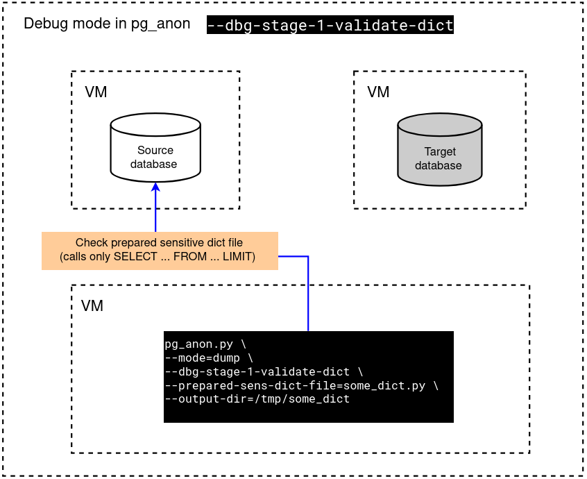
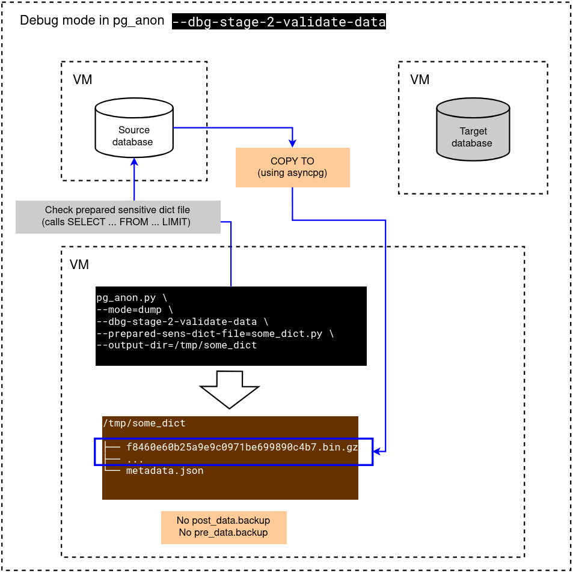
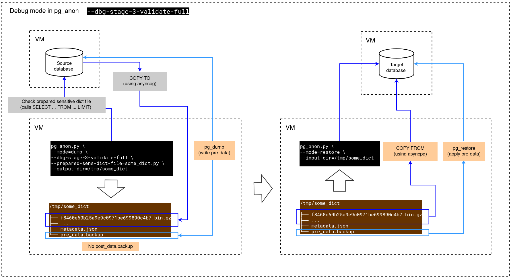

# 🛠️ Debug stages for the masking process

> [🏠 Home](../README.md#-documentation-index) | [💾 Dump](operations/dump.md) | [📂 Restore](operations/restore.md) | [⚙️ How it works](how-it-works.md) | [💬 FAQ](faq.md) 

## Overview

The debug stages allow you to test and troubleshoot the masking workflow without performing a full dump or restore, saving significant time and resources.

Each stage emulates a specific part of the masking pipeline:

- **Stage 1 — Validate Dict**

  Validates the sensitive dictionary and checks SQL logic without exporting any data.

- **Stage 2 — Validate Data**

  Performs masking checks on real data with a limited sample (LIMIT 100) using a prepared database schema.

- **Stage 3 — Validate Full**:
  
    Executes the full masking logic with data sampling (LIMIT 100), but without requiring a prepared database.

These stages help you quickly debug rules, masking functions, SQL conditions, and dictionary configuration before running a full dump/restore.

---

## Stage 1: Validate dict

This stage validate dictionary, show the tables and run SQL queries without data export into the disk or database.
So if program works without errors => the stage is passed.



```commandline
pg_anon dump \
    --db-host=127.0.0.1 \
    --db-user=postgres \
    --db-user-password=postgres \
    --db-name=test_source_db \
    --output-dir=test_dbg_stages \
    --prepared-sens-dict-file=test_dbg_stages.py \
    --clear-output-dir \
    --debug \
    --dbg-stage-1-validate-dict
```
---

## Stage 2: Validate data

Validate data, show the tables and run SQL queries with data export and limit 100 in prepared database.
This stage requires a target database that already holds the source structure, and only its
pre-data part: tables without indexes, constraints and triggers. pg_anon loads data with
`session_replication_role = 'replica'`, so a fully built target would accept the truncated
sample without error and end up holding rows its own foreign keys do not allow.

One way to prepare such a database quickly is a structure dump with
`--dbg-stage-3-validate-full`: the flag drops the post-data section.
[Stage 3](#stage-3-validate-full) below uses the same flag on its own.

One-time structure dump:

```commandline
pg_anon sync-struct-dump \
    --db-host=127.0.0.1 \
    --db-user=postgres \
    --db-user-password=postgres \
    --db-name=test_source_db \
    --output-dir=test_stage_2 \
    --prepared-sens-dict-file=test_dbg_stages.py \
    --clear-output-dir \
    --debug \
    --dbg-stage-3-validate-full
```

And then as many times as you want structure restore:

```commandline
su - postgres -c "psql -U postgres -d postgres -c \"DROP DATABASE IF EXISTS test_target_db_7\""
su - postgres -c "psql -U postgres -d postgres -c \"CREATE DATABASE test_target_db_7\""
pg_anon sync-struct-restore \
    --db-host=127.0.0.1 \
    --db-user=postgres \
    --db-user-password=postgres \
    --db-name=test_target_db_7 \
    --input-dir=test_stage_2 \
    --debug
```

- Validate data stage in dump:



```commandline
pg_anon dump \
    --db-host=127.0.0.1 \
    --db-user=postgres \
    --db-user-password=postgres \
    --db-name=test_source_db \
    --output-dir=test_dbg_stages \
    --prepared-sens-dict-file=test_dbg_stages.py \
    --clear-output-dir \
    --debug \
    --dbg-stage-2-validate-data
```

- Validate data stage in data-restore:

```commandline
pg_anon sync-data-restore \
    --db-host=127.0.0.1 \
    --db-user=postgres \
    --db-user-password=postgres \
    --db-name=test_target_db_7 \
    --input-dir=test_dbg_stages \
    --debug

# And for example view all data in every table:
su - postgres -c "psql -U postgres -d test_target_db_7 -c \"SELECT * FROM <schema>.<table>\""
```
---

## Stage 3: Validate full



Makes all logic with "limit 100" in SQL queries. In this stage you don't need prepared database, just run:

```commandline
su - postgres -c "psql -U postgres -d postgres -c \"DROP DATABASE IF EXISTS test_target_db_8\""
su - postgres -c "psql -U postgres -d postgres -c \"CREATE DATABASE test_target_db_8\""
```

- Validate full stage in dump:

```commandline
pg_anon dump \
    --db-host=127.0.0.1 \
    --db-user=postgres \
    --db-user-password=postgres \
    --db-name=test_source_db \
    --output-dir=test_dbg_stages \
    --prepared-sens-dict-file=test_dbg_stages.py \
    --clear-output-dir \
    --debug \
    --dbg-stage-3-validate-full
```

- Validate full stage in restore:

```commandline
pg_anon restore \
    --db-host=127.0.0.1 \
    --db-user=postgres \
    --db-user-password=postgres \
    --db-name=test_target_db_8 \
    --input-dir=test_dbg_stages \
    --debug

# And for example view all data in every table:
su - postgres -c "psql -U postgres -d test_target_db_8 -c \"SELECT * FROM <schema>.<table>\""
```
