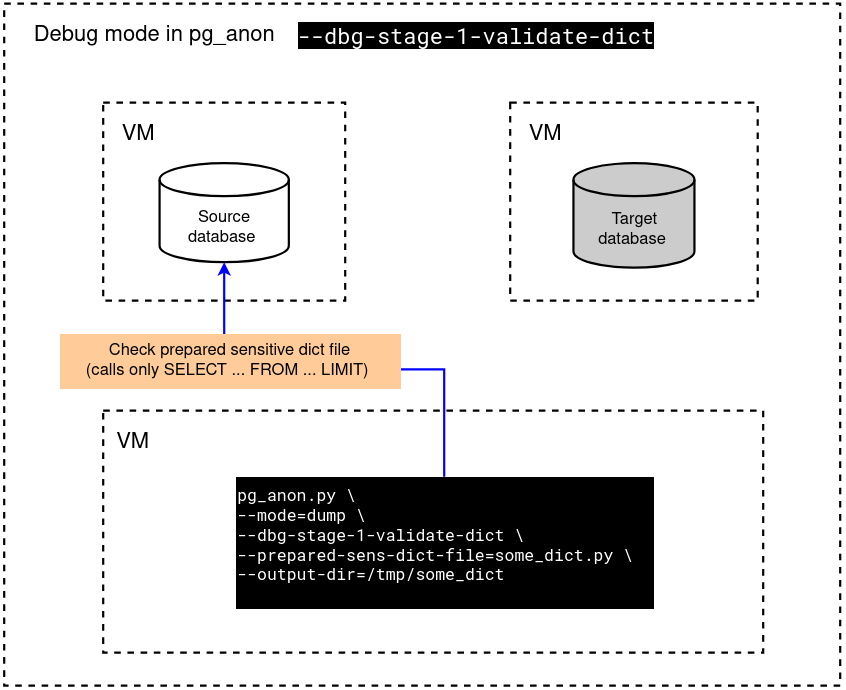
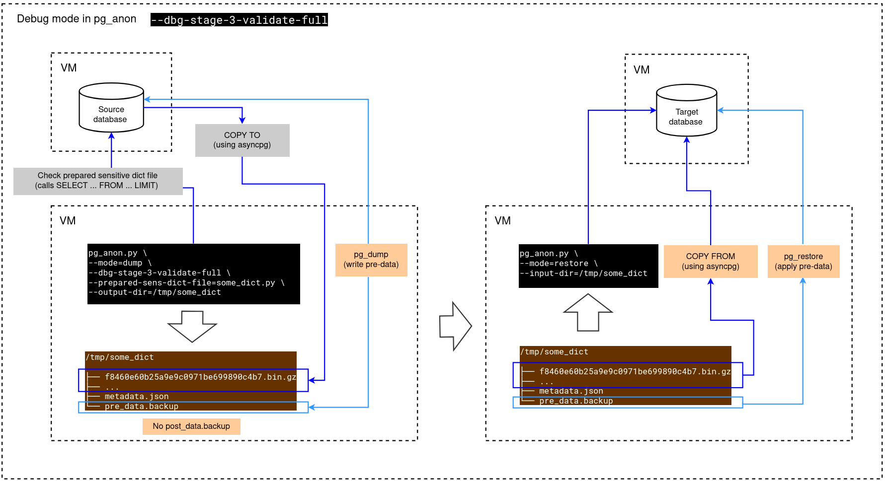

# 🛠️ Debug stages for anonymization process

> [🏠 Home](../README.md#-documentation-index) | [💾 Dump](operations/dump.md) | [📂 Restore](docs/operations/restore.md) | [⚙️ How it works](how-it-works.md) | [💬 FAQ](faq.md) 

## Overview

The debug stages allow you to test and troubleshoot the anonymization workflow without performing a full dump or restore, saving significant time and resources.

Each stage emulates a specific part of the anonymization pipeline:

- **Stage 1 — Validate Dict**

  Validates the sensitive dictionary and checks SQL logic without exporting any data.

- **Stage 2 — Validate Data**

  Performs anonymization checks on real data with a limited sample (LIMIT 100) using a prepared database schema.

- **Stage 3 — Validate Full**:
  
    Executes the full anonymization logic with data sampling (LIMIT 100), but without requiring a prepared database.

These stages help you quickly debug rules, anonymization functions, SQL conditions, and dictionary configuration before running a full anonymized dump/restore process.

---

## Stage 1: Validate dict

This stage validate dictionary, show the tables and run SQL queries without data export into the disk or database.
So if program works without errors => the stage is passed.



```commandline
   python pg_anon.py dump \
                     --db-host=127.0.0.1 \
                     --db-user=postgres \
                     --db-user-password=postgres \
                     --db-name=test_source_db \
                     --output-dir=test_dbg_stages \
                     --prepared-sens-dict-file=test_dbg_stages.py \
                     --clear-output-dir \
                     --verbose=debug \
                     --debug \
                     --dbg-stage-1-validate-dict
   ```
---

## Stage 2: Validate data

Validate data, show the tables and run SQL queries with data export and limit 100 in prepared database.
This stage requires database with all structure with only pre-data condition, which described in --prepared-sens-dict-file.


- If you want to create the database with required structure, just run:

One-time structure dump:

```commandline
   python pg_anon.py sync-struct-dump \
                     --db-host=127.0.0.1 \
                     --db-user=postgres \
                     --db-user-password=postgres \
                     --db-name=test_source_db \
                     --output-dir=test_stage_2 \
                     --prepared-sens-dict-file=test_dbg_stages.py \
                     --clear-output-dir \
                     --verbose=debug \
                     --debug \
                     --dbg-stage-3-validate-full
   ```

And then as many times as you want structure restore:

```commandline
   su - postgres -c "psql -U postgres -d postgres -c \"DROP DATABASE IF EXISTS test_target_db_7\""
   su - postgres -c "psql -U postgres -d postgres -c \"CREATE DATABASE test_target_db_7\""
   python pg_anon.py sync-struct-restore \
                     --db-host=127.0.0.1 \
                     --db-user=postgres \
                     --db-user-password=postgres \
                     --db-name=test_target_db_7 \
                     --input-dir=test_stage_2 \
                     --verbose=debug \
                     --debug 
   ```

- Validate data stage in dump:


```commandline
   python pg_anon.py dump \
                     --db-host=127.0.0.1 \
                     --db-user=postgres \
                     --db-user-password=postgres \
                     --db-name=test_source_db \
                     --output-dir=test_dbg_stages \
                     --prepared-sens-dict-file=test_dbg_stages.py \
                     --clear-output-dir \
                     --verbose=debug \
                     --debug \
                     --dbg-stage-2-validate-data
   ```

- Validate data stage in data-restore:

```commandline
   python pg_anon.py sync-data-restore \
                     --db-host=127.0.0.1 \
                     --db-user=postgres \
                     --db-user-password=postgres \
                     --db-name=test_target_db_7 \
                     --input-dir=test_dbg_stages \
                     --verbose=debug \
                     --debug 
   
   # And for example view all data in every table:
   su - postgres -c "psql -U postgres -d test_target_db_7 -c \"SELECT * FROM public.contracts\""
   ```
---

## Stage 3: Validate full



Makes all logic with "limit 100" in SQL queries. In this stage you don't need prepared database, just run:

```commandline
   su - postgres -c "psql -U postgres -d postgres -c \"DROP DATABASE IF EXISTS test_target_db_8\""
   su - postgres -c "psql -U postgres -d postgres -c \"CREATE DATABASE test_target_db_8\""
   ```

- Validate full stage in dump:

```commandline
   python pg_anon.py dump \
                     --db-host=127.0.0.1 \
                     --db-user=postgres \
                     --db-user-password=postgres \
                     --db-name=test_source_db \
                     --output-dir=test_dbg_stages \
                     --prepared-sens-dict-file=test_dbg_stages.py \
                     --clear-output-dir \
                     --verbose=debug \
                     --debug \
                     --dbg-stage-3-validate-full
   ```

- Validate full stage in restore:

```commandline
   python pg_anon.py restore \
                     --db-host=127.0.0.1 \
                     --db-user=postgres \
                     --db-user-password=postgres \
                     --db-name=test_target_db_8 \
                     --input-dir=test_dbg_stages \
                     --verbose=debug \
                     --debug 
   
   # And for example view all data in every table:
   su - postgres -c "psql -U postgres -d test_target_db_8 -c \"SELECT * FROM public.contracts\""
   ```
