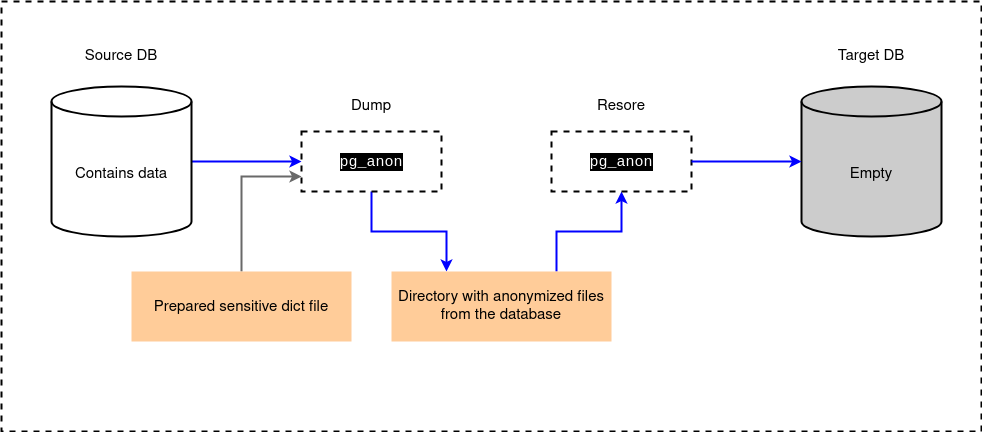

# How it works
> [🏠 Home](../README.md#-documentation-index) | [💬 FAQ](faq.md)

## Anonymization (masking)

The diagram below illustrates how data is transferred from the **source DB** to the **target DB**.

The source database contains sensitive information and is typically located in a production environment with strictly limited access.



A trusted administrator runs pg_anon with credentials for the **source DB**.
Using the prepared and approved sensitive dictionary, pg_anon creates an anonymized dump in the specified directory.
The dictionary must be created in advance and validated by the security team.

The resulting dump directory is then transferred to the host of the target database.
Compression during transfer is unnecessary because the dump files are already compressed.

Once the directory is placed on the target host, the restore process is started using target database credentials.
The target database must be created beforehand using CREATE DATABASE and must be empty.

After a successful restore, the anonymized database is ready for development or testing. Any number of employees can safely use it without risking exposure of sensitive data.

---

## What kind of work does pg_anon do inside during dump and restore? The simplest representation.

### For example, we have data that we want to anonymize:

1. Create the `source` table:

```SQL
create table users (
    id bigserial,
    email text,
    login text
);

-- Checking the contents of the source table
select * from users;
```
``` output
>>
    id |  email  | login 
   ----+---------+-------
```

2. Populating the `source` table:

```SQL
insert into users (email, login)
select
 'user' || generate_series(1001, 1020) || '@example.com',
 'user' || generate_series(1001, 1020);

-- Checking the contents of the source table
select * from users;
```
```output
>>
    id |	email	      |  login   
   ----+----------------------+----------
     1 | user1001@example.com | user1001
     2 | user1002@example.com | user1002
    ...
```

**The 'email' field contains `sensitive data`. We need to `anonymize` it.**


### What is the process of creating a dump with masking?

1. Data `dump` from the `source` table to a CSV file (without masking):

```SQL
copy (
	select *
	from users
) to '/tmp/users.csv' with csv;
```
```output
cat /tmp/users.csv
>>
   1,user1001@example.com,user1001
   2,user1002@example.com,user1002
   ...
```

2. `Masking` the contents of the `source` table:

```SQL
select
   id,
   md5(email) || '@abc.com' as email, -- hashing the email (masking rule in prepared sens dict file)
   login
from users;
```
```output
>>
    id |              	email                     |  login   
   ----+------------------------------------------+----------
     1 | 385513d80895c4c5e19c91d1df9eacae@abc.com | user1001
     2 | 9f4c0c30f85b0353c4d5fe3c9cc633e3@abc.com | user1002
    ...
```

3. Data `dump` from the `source` table to a CSV file (with `masking`):

```SQL
copy (
  select
    id,
    md5(email) || '@abc.com' as email, -- hashing the email (masking rule in prepared sens dict file)
    login
  from users
) to '/tmp/users_anonymized.csv' with csv;
```
```output
cat /tmp/users_anonymized.csv
>>
   1,385513d80895c4c5e19c91d1df9eacae@abc.com,user1001
   2,9f4c0c30f85b0353c4d5fe3c9cc633e3@abc.com,user1002
   ...
```

**The `prepared sens dict file` contains masking rules like hashing**

### What is the process for restoring a masked dump?

1. Reproducing of the structure. Creating the `target` table:

```SQL
create table users_anonymized (
    id bigserial,
    email text,
    login text
);

-- Checking the contents of the target table
select * from users_anonymized;
```
```output
>>
    id |  email  | login 
   ----+---------+-------
```

2. Loading data from the `source` table data `dump` (CSV file) to `target` table:

```SQL
copy users_anonymized
from '/tmp/users_anonymized.csv'
with csv;

-- Checking the contents of the target table
select * from users_anonymized;
```
```output
>>
    id |              	email                     |  login   
   ----+------------------------------------------+----------
     1 | 385513d80895c4c5e19c91d1df9eacae@abc.com | user1001
     2 | 9f4c0c30f85b0353c4d5fe3c9cc633e3@abc.com | user1002
    ...
```

### Differences between original work of pg_anon and that representation:
- `pg_anon` operates on the entire database (not only one table)
- `pg_anon` uses `.bin.gz` files to save data (not csv)
- Masking rules are provided to `pg_anon` via a `prepared sens dict file`

